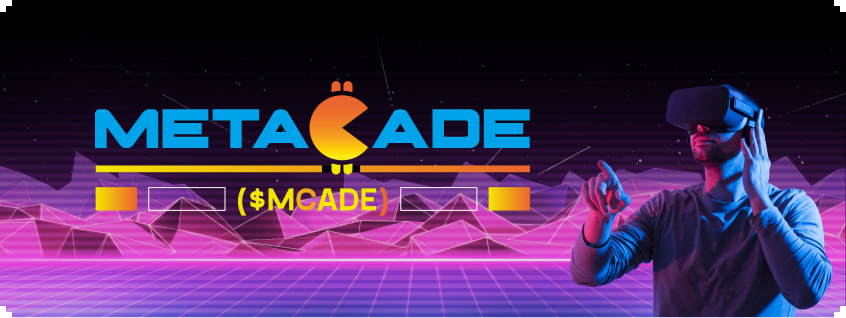

    

        
    

    <section class="buttons-container">
        <button class="buttons-container__button" style="background-color: #BE1EC7;">
            <a class=""href="https://metacade.co" style="color: white;">web site</a>
        </button>
        <button class="buttons-container__button" style="background-color: #00A2E9;">
            <a href="" style="color: white;">metacade platform</a>
        </button>
        <button class="buttons-container__button" style="background-color: #F5CA2A;">
            <a href="https://google.com">whitepaper</a>
        </button>
        <button class="buttons-container__button" style="background-color: #00D0AD;">
            <a href="https://google.com">certik audit</a>
        </button>
    </section>
    

    <section class="socials">
        <h2 class="section__heading">our socials</h2>
        

            <button class="socials__social-link-buttons__button">
                
            </button>
            <button class="socials__social-link-buttons__button" style="padding: 12px 8px; width: 49px;">
                
            </button>
            <button class="socials__social-link-buttons__button" style="width: 48px;">
                
            </button>
            <button class="socials__social-link-buttons__button" style="width: 48px; height: 47.5px; padding: 8px 10.4px 7.5px">
                
            </button>
            <button class="socials__social-link-buttons__button" style="padding: 10px 8px">
                
            </button>
            <button class="socials__social-link-buttons__button" style="width: 49px;">
                
            </button>
            <button class="socials__social-link-buttons__button" style="width: 48px;">
                
            </button>
            <button class="socials__social-link-buttons__button" style="width: 48px; padding: 9px">
                
            </button>
        

    </section>
    

    <section class="metasystem">
        <h2 class="section__heading">metasystem</h2>
        

            

                
                
Our community hub will focus on the most pressing narratives and trending developments in the blockchain gaming ecosystem. With you, we want to blitz the Web3 market by building a one-stop platform for Metaverse enthusiasts to network and build their careers in the high-potential P2E world.

            

            

            

                
                
Test Contributors will be rewarded in $MCADE along with limited edition staking options. When we say, "Metacade is designed by gamers, for gamers," we mean it. Access various ongoing side hustles by contributing alpha, content, opinions, and ideas in the community based on the trending topics each month.

            

            

            

                
                
With Metacade, you don't need to be a games developer to become a key influencer. Search the live 'side hustles' each week, and contribute to the platform and community to reap attractive rewards.

            

        

    </section>
    

    <section class="metaplatform">
        

            
            <h2 class="section__heading">metacade Game platform</h2>
            
        

        
    </section>
    

    <section class="metaheads">
         

            
            <h2 class="section__heading">metaheads</h2>
        

        
    </section>
    

